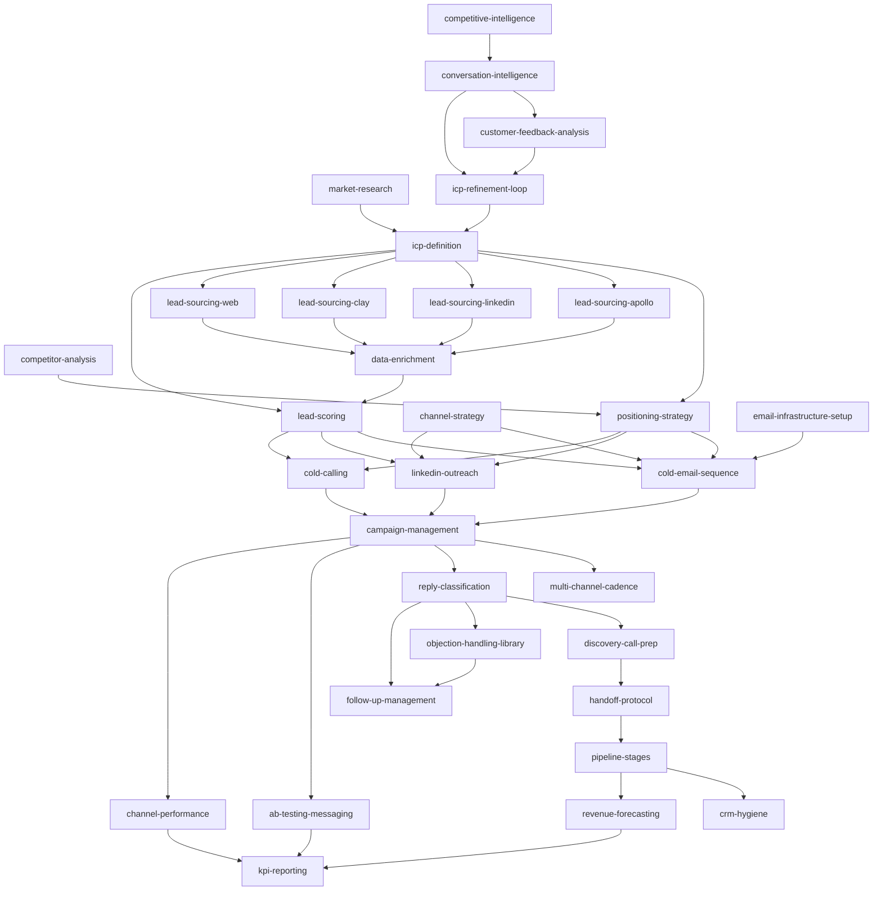

# GTM Agent Skills

**A complete go-to-market operator's playbook — 32 skills, 6 categories, any agent.**

> Built by [Crewm8](https://crewm8.ai) — a free, open-source skill graph for the agent ecosystem. **Hermes-native** — works with Hermes Agent, Claude Code, Factory Droid, Cursor, Windsurf, OpenClaw, OpenAI agents, and any markdown-skill-aware agent.

---

## What This Is

32 discrete, agent-agnostic skills covering every function of B2B GTM operations — from market intelligence and ICP definition through lead sourcing, outreach execution, sales conversations, pipeline management, and analytics. Each skill works independently and chains together for automated workflows.

- **32 SKILL.md files** (Hermes-conformant, ≤120 lines each) organized into 6 categories
- **references/** deep-dive files loaded on demand — frameworks, worked examples, eval cases, CRM mapping
- **scripts/** helper scripts using `${HERMES_SKILL_DIR}` token — push-to-CRM, lead normalization, dedup, scoring
- **schemas/lead.schema.json** — canonical Lead record JSON Schema for validation
- **graph.json** — machine-readable skill dependency DAG
- **crm-adapters/** — pluggable CRM push (agentic-app, CSV, extensible)
- **CI validated** — GitHub Actions workflow validates frontmatter, body sections, line counts, script compilation, and graph integrity

---

## Directory Structure

```
gtm-agent-skills/
├── intelligence/                Market Intelligence (strategy foundation)
│   ├── market-research/
│   │   ├── SKILL.md              ≤120 lines, Hermes-conformant
│   │   ├── references/           Deep frameworks + examples + eval cases
│   │   └── scripts/              push_to_crm.py + skill-specific scripts
│   ├── competitor-analysis/
│   ├── icp-definition/
│   ├── positioning-strategy/
│   ├── channel-strategy/
│   └── competitive-intelligence/
│
├── lead-gen/                     Lead Generation (sourcing + enrichment + scoring)
│   ├── _conventions/             Shared conventions, schemas, scripts
│   │   ├── conventions.md
│   │   ├── lead_schema.json → ../../schemas/lead.schema.json
│   │   └── scripts/              normalize_lead.py, dedup_leads.py, push_to_crm.py
│   ├── lead-sourcing-apollo/
│   ├── lead-sourcing-linkedin/
│   ├── lead-sourcing-clay/
│   ├── lead-sourcing-web/
│   ├── data-enrichment/
│   └── lead-scoring/
│
├── outreach/                     Outreach Execution (email + LinkedIn + call + cadence)
│   ├── _conventions/
│   ├── email-infrastructure-setup/
│   ├── cold-email-sequence/
│   ├── linkedin-outreach/
│   ├── cold-calling/
│   ├── campaign-management/
│   └── multi-channel-cadence/
│
├── conversations/                Sales Conversations (triage + objections + discovery + follow-up)
│   ├── _conventions/
│   ├── reply-classification/
│   ├── objection-handling-library/
│   ├── discovery-call-prep/
│   └── follow-up-management/
│
├── pipeline/                     Pipeline Management (stages + hygiene + handoff + intel + forecast)
│   ├── pipeline-stages/
│   ├── crm-hygiene/
│   ├── handoff-protocol/
│   ├── conversation-intelligence/
│   └── revenue-forecasting/
│
├── analytics/                    Analytics & Optimization (A/B + channel + feedback + KPI + ICP loop)
│   ├── _conventions/
│   ├── ab-testing-messaging/
│   ├── channel-performance/
│   ├── customer-feedback-analysis/
│   ├── kpi-reporting/
│   └── icp-refinement-loop/
│
├── crm-adapters/                 Pluggable CRM push targets
│   ├── agentic-app/push.py
│   └── csv/push.py
│
├── schemas/
│   └── lead.schema.json          Canonical Lead record JSON Schema
│
├── graph.json                    Machine-readable skill dependency DAG
│
├── tests/
│   ├── run.sh                    Validation test suite
│   └── icp-definition/           Example test fixture
│
└── .github/workflows/
    └── validate-skills.yml        CI pipeline
```

---

## Skill Graph



Machine-readable version: [`graph.json`](graph.json)

---

## Installation

### Hermes Agent (recommended)

```bash
hermes skills tap add devangk003/gtm-agent-skills
hermes skills install gtm-agent-skills/intelligence/icp-definition
hermes skills install gtm-agent-skills/lead-gen/lead-sourcing-apollo
# ... or install all skills in a category:
hermes skills install gtm-agent-skills/intelligence
```

### Claude Code

```bash
git clone https://github.com/devangk003/gtm-agent-skills.git ~/.crew-skills
ln -s ~/.crew-skills/intelligence /path/to/project/.claude/skills/
```

### Factory Droid

```bash
cp -r ~/.crew-skills/intelligence/* .factory/skills/       # project-level
cp -r ~/.crew-skills/intelligence/* ~/.factory/skills/      # personal-level
```

### Cursor / Windsurf

```bash
ln -s ~/.crew-skills/intelligence /path/to/project/.cursor/skills/
# Reference in .cursorrules: "You have GTM skills at ~/.crew-skills/"
```

### OpenClaw Agent

Clone the repository and point OpenClaw at the category directories. Each SKILL.md uses the universal format (`name`, `description`, `tags`) that OpenClaw natively recognizes for skill discovery.

### OpenAI agents / Custom GPTs

Upload individual SKILL.md files as knowledge base documents. No special configuration needed.

### Any markdown-aware agent

Point your agent at the category directories. Flat YAML frontmatter under `metadata.hermes.*` is the universal standard. Skills reference `${HERMES_SKILL_DIR}/scripts/` and `${HERMES_SKILL_DIR}/references/` for progressive disclosure.

---

## SKILL.md Format (Hermes-conformant)

Every skill uses the Hermes Agent skill format:

```yaml
---
name: icp-definition
description: Define a tiered ICP with a 100-pt scorecard, role map, and anti-ICP boundary. Use when the user says "define our ICP", "tighten qualification", or shares won-deal lists.
version: 2.1.0
author: Crewm8
license: MIT
metadata:
  hermes:
    tags: [GTM, ICP, Segmentation, Qualification]
    related_skills: [market-research, positioning-strategy, lead-scoring]
    config:
      - key: gtm.crm_url
        description: agentic-app CRM endpoint
        default: "http://localhost:4210"
      - key: gtm.crm_adapter
        description: "Which CRM adapter (agentic-app | csv | none)"
        default: "agentic-app"
required_environment_variables:
  - name: AGENTIC_APP_TOKEN
    prompt: "agentic-app bearer token"
    required_for: "Pushing records to CRM"
---

# ICP Definition

Produce a tiered, scored, evidence-backed ICP an SDR can apply in 2 minutes.

## When to Use
- "Define our ICP" / "Who should we target?"
- Shares won-deal list and asks to tighten qualification
- ...

## Quick Reference
| Concept | Value |
|---|---|
| Scorecard weights | Pain 25 / Trigger 20 / WTP 20 / Reach 15 / TTV 10 / Strategic 10 |

## Procedure
1. Anchor in evidence.
2. ...
9. Push to CRM: `python ${HERMES_SKILL_DIR}/scripts/push_to_crm.py`

## Pitfalls
- Aspirational ICP. Won deals override stated ICP.
- ...

## Verification
- SDR can qualify a lead in 2 minutes from the one-pager.
```

Body sections: **When to Use → Quick Reference → Procedure → Pitfalls → Verification**. Depth moves to `references/`. Helper scripts to `scripts/`.

---

## Key Design Principles

- **Hermes-native frontmatter:** `metadata.hermes.tags`, `related_skills`, `config`, `required_environment_variables` — Hermes auto-discovers, auto-prompts for env vars, and conditionally activates based on `requires_tools`.
- **Progressive disclosure:** SKILL.md ≤120 lines with the common path first. `references/` loaded on demand — frameworks, worked examples, eval cases, CRM mapping. Saves context tokens.
- **Helper scripts in `scripts/`:** `${HERMES_SKILL_DIR}` token resolves to the absolute skill directory at runtime. Push-to-CRM, lead normalization, dedup, scoring — all executable via `python ${HERMES_SKILL_DIR}/scripts/push_to_crm.py`.
- **Pluggable CRM adapters:** Skills emit structured JSON; `crm-adapters/` handles the transport. Ship one adapter per CRM (agentic-app, CSV, HubSpot, Salesforce, Attio). Select via `gtm.crm_adapter` config.
- **Three-mode degradation:** Tool-bound skills handle API mode, manual export mode, and BYO mode with graceful degradation.
- **Anti-fabrication provenance:** `[user-provided]` / `[verified: source]` / `[hypothetical]` / `[unverified — needs check]` tags on every named entity.
- **Machine-readable dependency graph:** `graph.json` enables agents to resolve "I need lead-scoring; what runs before it?" programmatically.
- **JSON Schema validation:** `schemas/lead.schema.json` validates every lead record before push.
- **CI validated:** GitHub Actions validates frontmatter, body sections, line counts, script compilation, and graph integrity on every push.

---

## Skill Index

### Intelligence — Market Intelligence (6 skills)

| # | Skill | Description | Trigger phrases |
|---|-------|-------------|-----------------|
| 1 | [market-research](intelligence/market-research/) | Size a target market via triangulated TAM/SAM/SOM | "market sizing", "what's our SAM" |
| 2 | [competitor-analysis](intelligence/competitor-analysis/) | Map competitive landscape by tier | "battle cards", "who are we against" |
| 3 | [icp-definition](intelligence/icp-definition/) | Define tiered ICP via 100-pt scorecard | "define our ICP", "tighten qualification" |
| 4 | [positioning-strategy](intelligence/positioning-strategy/) | Define positioning via Dunford's 5-component framework | "positioning", "our value prop" |
| 5 | [channel-strategy](intelligence/channel-strategy/) | Prioritize GTM channels via Bullseye Framework | "which channels first", "channel mix" |
| 6 | [competitive-intelligence](intelligence/competitive-intelligence/) | Operationalize competitor monitoring with signal scoring | "track competitors", "set up alerts" |

### Lead Gen — Lead Generation (6 skills)

| # | Skill | Description | Requires |
|---|-------|-------------|----------|
| 7 | [lead-sourcing-apollo](lead-gen/lead-sourcing-apollo/) | Source B2B leads from Apollo | `APOLLO_API_KEY` |
| 8 | [lead-sourcing-linkedin](lead-gen/lead-sourcing-linkedin/) | Source leads via LinkedIn Sales Navigator | LI seat |
| 9 | [lead-sourcing-clay](lead-gen/lead-sourcing-clay/) | Source leads via Clay multi-source orchestration | Clay seat |
| 10 | [lead-sourcing-web](lead-gen/lead-sourcing-web/) | Source leads from open web | `SERP_API_KEY` |
| 11 | [data-enrichment](lead-gen/data-enrichment/) | Enrich leads with verified emails, phones, hooks | verifier API |
| 12 | [lead-scoring](lead-gen/lead-scoring/) | Score leads against ICP scorecard + BANT/CHAMP | — |

### Outreach — Outreach Execution (6 skills)

| # | Skill | Description |
|---|-------|-------------|
| 13 | [email-infrastructure-setup](outreach/email-infrastructure-setup/) | Set up outbound domains, SPF/DKIM/DMARC, warmup |
| 14 | [cold-email-sequence](outreach/cold-email-sequence/) | Write 5–7 touch email sequences using CCQ framework |
| 15 | [linkedin-outreach](outreach/linkedin-outreach/) | Execute LinkedIn outreach with ToS compliance |
| 16 | [cold-calling](outreach/cold-calling/) | Generate cold-call scripts with TCPA compliance |
| 17 | [campaign-management](outreach/campaign-management/) | Monitor active cadences with pause/slow-down decisions |
| 18 | [multi-channel-cadence](outreach/multi-channel-cadence/) | Compose 5–9 touches across channels into a cadence |

### Conversations — Sales Conversations (4 skills)

| # | Skill | Description |
|---|-------|-------------|
| 19 | [reply-classification](conversations/reply-classification/) | Classify inbound replies into 9 routing labels |
| 20 | [objection-handling-library](conversations/objection-handling-library/) | Match objections to 12-category library with response variants |
| 21 | [discovery-call-prep](conversations/discovery-call-prep/) | Produce 1-page founder/AE briefing |
| 22 | [follow-up-management](conversations/follow-up-management/) | Manage post-reply nurture and re-engagement |

### Pipeline — Pipeline Management (5 skills)

| # | Skill | Description |
|---|-------|-------------|
| 23 | [pipeline-stages](pipeline/pipeline-stages/) | Move deals through 8-stage pipeline with MEDDPICC gates |
| 24 | [crm-hygiene](pipeline/crm-hygiene/) | Maintain CRM data quality — dedup, normalization, stale flags |
| 25 | [handoff-protocol](pipeline/handoff-protocol/) | Hand off SAL-eligible leads from SDR to AE |
| 26 | [conversation-intelligence](pipeline/conversation-intelligence/) | Mine call transcripts for patterns and alerts |
| 27 | [revenue-forecasting](pipeline/revenue-forecasting/) | Forecast 30/60/90 revenue with weighted-pipeline math |

### Analytics — Analytics & Optimization (5 skills)

| # | Skill | Description |
|---|-------|-------------|
| 28 | [ab-testing-messaging](analytics/ab-testing-messaging/) | Design and run A/B tests on messaging variables |
| 29 | [channel-performance](analytics/channel-performance/) | Analyze per-channel performance with marginal-CAC |
| 30 | [customer-feedback-analysis](analytics/customer-feedback-analysis/) | Analyze feedback from won deals, churn, reviews |
| 31 | [kpi-reporting](analytics/kpi-reporting/) | Produce weekly GTM KPI report with WoW deltas |
| 32 | [icp-refinement-loop](analytics/icp-refinement-loop/) | Refine ICP scorecard after ≥30 closed deals |

---

## License & Credits

- **License:** MIT — free to use, modify, and distribute
- **Built by:** [Crewm8](https://crewm8.ai)
- **Repository:** [github.com/devangk003/gtm-agent-skills](https://github.com/devangk003/gtm-agent-skills)
