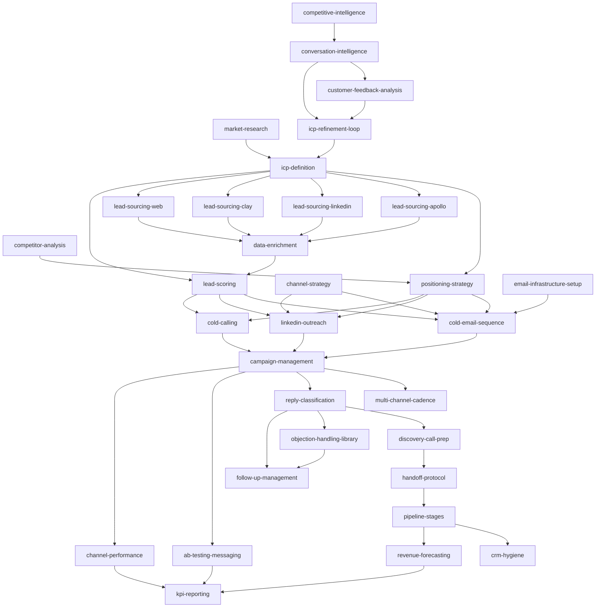

# GTM Agent Skills

**A complete go-to-market operator's playbook — 32 skills, 6 functions, any agent.**

> Built by [Crewm8](https://crewm8.ai) — a free, open-source skill graph for the agent ecosystem. Works with Hermes Agent, Claude Code, Factory Droid, Cursor, Windsurf, OpenClaw, OpenAI agents, and any markdown-skill-aware agent.

---

## What This Is

32 discrete, agent-agnostic skills covering every function of B2B GTM operations — from market intelligence and ICP definition through lead sourcing, outreach execution, sales conversations, pipeline management, and analytics. Each skill works independently and chains together for automated workflows.

- **32 SKILL.md files** (plus SKILL-DETAILED.md deep versions for functions 1–2) organized into 6 functions
- **Agent-agnostic:** No agent-specific metadata. Universal YAML frontmatter format.
- **CRM-integrated:** Skills push structured output to an interoperable Markdown wiki CRM (`agentic-app/`) via `POST /api/push`.
- **Open source:** MIT license. Built by Crewm8. Free for any agent to use.

---

## About Crewm8

[Crewm8](https://crewm8.ai) builds autonomous agents for go-to-market operations. This skill graph is our gift to the agent ecosystem — a complete, production-tested set of GTM capabilities that any agent can load and use immediately.

---

## Skill Graph

This is the dependency graph showing how skills chain together in a typical GTM workflow:



---

## Installation

### Hermes Agent
```bash
hermes skills tap add devangk003/gtm-agent-skills
hermes skills install devangk003/gtm-agent-skills/function-1-skills/market-research-v2
```

### Claude Code
```bash
git clone https://github.com/devangk003/gtm-agent-skills.git ~/.crew-skills
ln -s ~/.crew-skills/function-1-skills /path/to/project/.claude/skills/
```

### Factory Droid
```bash
cp -r ~/.crew-skills/function-1-skills/* .factory/skills/       # project-level
cp -r ~/.crew-skills/function-1-skills/* ~/.factory/skills/      # personal-level
```

### Cursor / Windsurf
```bash
ln -s ~/.crew-skills/function-1-skills /path/to/project/.cursor/skills/
# Reference in .cursorrules: "You have GTM skills at ~/.crew-skills/"
```

### OpenClaw Agent
Clone the repository and point OpenClaw at the `function-N-skills/` directories. Each SKILL.md uses the universal format (`name`, `description`, `tags`) that OpenClaw natively recognizes for skill discovery.

### OpenAI agents / Custom GPTs
Upload individual SKILL.md files as knowledge base documents. No special configuration needed.

### Any markdown-aware agent
Point your agent at the `function-N-skills/` directories. Flat YAML frontmatter (`name`, `description`, `tags`) is the universal standard.

---

## Skill Index

### Function 1 — Market Intelligence (6 skills)

| # | Skill | Description | Deliverables |
|---|-------|-------------|--------------|
| 1 | [market-research](function-1-skills/market-research-v2/) | Size a target market via triangulated TAM/SAM/SOM, bowling-pin segment scoring, JTBD framing, and whitespace identification | Market-type diagnosis, TAM/SAM/SOM with confidence labels, segment breakdown, whitespace cards |
| 2 | [competitor-analysis](function-1-skills/competitor-analysis-v2/) | Map competitive landscape by tier (Direct/Indirect/Substitute/Aspirational), profile positioning/pricing/moats, produce 1-page battle cards | Tiered competitor list, per-competitor profiles, comparison matrix, 7 Powers moat analysis, battle cards |
| 3 | [icp-definition](function-1-skills/icp-definition-v2/) | Define tiered ICP via 100-point scorecard, role mapping, Pain-Trigger-Outcome chains, anti-ICP boundary, trigger event library | ICP one-pager, qualification scorecard, role map, pain chains, trigger events |
| 4 | [positioning-strategy](function-1-skills/positioning-strategy-v2/) | Define positioning via Dunford's 5-component framework, JTBD wedge, message house, value-by-role, for-and-against wedge | Positioning canvas, alternatives analysis, wedge statement, message house, value props by role |
| 5 | [channel-strategy](function-1-skills/channel-strategy-v2/) | Prioritize GTM channels via Bullseye Framework (19 channels), CAC/LTV math, channel-fit-by-ICP scoring, stage-appropriate selection | Bullseye allocation, CAC/LTV viability table, top-3 deep dives, experiment designs, kill/scale criteria |
| 6 | [competitive-intelligence](function-1-skills/competitive-intelligence-v2/) | Operationalize competitor monitoring with signal scoring, tiered watch-lists, alert routing, intel-to-action workflow, battle-card refresh | Watch-lists, signal taxonomy, alert rules, cadence schedule, intel-to-action workflow |

### Function 2 — Lead Generation (6 skills)

| # | Skill | Description | Deliverables |
|---|-------|-------------|--------------|
| 7 | [lead-sourcing-apollo](function-2-skills/lead-sourcing-apollo-v2/) | Source B2B leads from Apollo (API / manual export / BYO list) with ICP-grounded filters, cost quoting, schema normalization | Normalized lead records, search filter set, cost/coverage report, dedup log |
| 8 | [lead-sourcing-linkedin](function-2-skills/lead-sourcing-linkedin-v2/) | Source leads via LinkedIn Sales Navigator with role/trigger criteria, session-based tool execution, ToS-compliant normalization | Sales Nav filter recipes, normalized leads, PhantomBuster/HeyReach specs |
| 9 | [lead-sourcing-clay](function-2-skills/lead-sourcing-clay-v2/) | Source leads via Clay's table-based orchestration of Apollo, Hunter, Clearbit, Apify with cost-aware multi-source chaining | Normalized leads, Clay table spec, multi-source cost report, dedup log |
| 10 | [lead-sourcing-web](function-2-skills/lead-sourcing-web-v2/) | Source leads from open web — job boards, news, press releases, RFPs, podcasts — with citation-grade provenance | Normalized leads with citations, search query set, trigger evidence permalinks |
| 11 | [data-enrichment](function-2-skills/data-enrichment-v2/) | Enrich raw leads with verified emails, phones, social links, citable personalization hooks via verifier waterfall | Patched lead records, verification log, personalization hooks, missing-fields report |
| 12 | [lead-scoring](function-2-skills/lead-scoring-v2/) | Score leads against ICP scorecard + BANT/CHAMP + trigger-strength formula; write score + priority + tier onto person record | Per-lead score/tier/priority, BANT/CHAMP status, tier distribution, SAL handoff criteria |

### Function 3 — Outreach Execution (6 skills)

| # | Skill | Description | Deliverables |
|---|-------|-------------|--------------|
| 13 | [email-infrastructure-setup](function-3-skills/email-infrastructure-setup-v2/) | Set up dedicated outbound domains, SPF/DKIM/DMARC, RFC 8058 List-Unsubscribe, 14+ day warmup, readiness flag | Domain list, DNS records, warmup schedule, reputation baseline, readiness flag |
| 14 | [cold-email-sequence](function-3-skills/cold-email-sequence-v2/) | Write 5–7 touch email sequences using CCQ framework, Pain-Trigger-Outcome openers, mobile-first formatting, hook contract enforcement | Email sequence copy, per-touch content, cliche audit log, cadence handoff |
| 15 | [linkedin-outreach](function-3-skills/linkedin-outreach-v2/) | Execute LinkedIn outreach via Sales Nav + session tools — connection requests, follow-ups, InMails — with strict ToS compliance | Connection notes ≤300 chars, follow-up templates, InMail templates, account safety report |
| 16 | [cold-calling](function-3-skills/cold-calling-v2/) | Generate cold-call scripts (9-sec opener, discovery, gatekeeper, voicemail) with TCPA-compliant DNC scrubbing, dialer orchestration | Opener script, discovery questions, gatekeeper handler, voicemail script, dial list |
| 17 | [campaign-management](function-3-skills/campaign-management-v2/) | Monitor active multi-channel cadences in real-time — reply/bounce/complaint rates, sender reputation — with pause/slow-down/swap decisions | Campaign metrics summary, pause decisions, A/B test results, reputation alerts |
| 18 | [multi-channel-cadence](function-3-skills/multi-channel-cadence-v2/) | Compose 5–9 touches across email + LinkedIn + call into a 14–21 day cadence with channel-isolation rules, branch logic, exit conditions | Multi-channel cadence config, per-channel handoffs, capacity plan, branch/exit rules |

### Function 4 — Sales Conversations (4 skills)

| # | Skill | Description | Deliverables |
|---|-------|-------------|--------------|
| 19 | [reply-classification](function-4-skills/reply-classification-v2/) | Classify inbound replies into 9 routing labels (positive/not-now/not-interested/etc.) with confidence scoring and skill dispatch | Per-reply classification with confidence, routing recommendations, manual review queue |
| 20 | [objection-handling-library](function-4-skills/objection-handling-library-v2/) | Match embedded objections to 12-category canonical library, produce 2–3 response variants, recommend cadence-state action | Objection classification, ranked response variants, cadence-state recommendation |
| 21 | [discovery-call-prep](function-4-skills/discovery-call-prep-v2/) | Produce 1-page founder/AE briefing — ICP fit, signals, MEDDPICC slots, discovery questions, objections, competitive context | 1-page briefing, MEDDPICC snapshot, discovery questions, objection responses, call agenda |
| 22 | [follow-up-management](function-4-skills/follow-up-management-v2/) | Manage post-reply nurture, scheduling, re-engagement for not-now/OOO/warm-but-not-now recipients with 30/60/90-day cadences | Resume/nurture schedule, parsed resume dates, follow-up touch handoffs, no-show rescue flow |

### Function 5 — Pipeline Management (5 skills)

| # | Skill | Description | Deliverables |
|---|-------|-------------|--------------|
| 23 | [pipeline-stages](function-5-skills/pipeline-stages-v2/) | Move deals through 8-stage B2B pipeline with deterministic stage-gate rules, MEDDPICC completion criteria, event triggers | Stage-transition decisions, MEDDPICC gate audits, missing-slot flags for stuck deals |
| 24 | [crm-hygiene](function-5-skills/crm-hygiene-v2/) | Maintain CRM data quality — required-field gates, dedup, normalization, stale-record flagging, orphaned-interaction cleanup | Hygiene violation report, dedup merge plan, normalization fixes, stale flags |
| 25 | [handoff-protocol](function-5-skills/handoff-protocol-v2/) | Hand off SAL-eligible leads from SDR to AE with briefing package, MEDDPICC snapshot, conversation history, acceptance criteria | Handoff package, MEDDPICC snapshot, conversation transcript, acceptance/rejection tracking |
| 26 | [conversation-intelligence](function-5-skills/conversation-intelligence-v2/) | Mine call transcripts, reply text, meeting notes for competitor mentions, pricing pushback, feature requests, champion/blocker signals | Pattern extraction, cross-conversation aggregation, frequency alerts, routing recommendations |
| 27 | [revenue-forecasting](function-5-skills/revenue-forecasting-v2/) | Forecast 30/60/90 day revenue via weighted-pipeline math, historical conversion rates, conservative/base/aggressive scenarios | 30-60-90 day forecast with scenarios, per-deal breakdown, assumption set, accuracy audit |

### Function 6 — Analytics & Optimization (5 skills)

| # | Skill | Description | Deliverables |
|---|-------|-------------|--------------|
| 28 | [ab-testing-messaging](function-6-skills/ab-testing-messaging-v2/) | Design and run A/B tests on messaging variables — sample size computation, Bayesian/frequentist analysis, winner declaration | Sample size estimate, test design doc, significance call, winner recommendation |
| 29 | [channel-performance](function-6-skills/channel-performance-v2/) | Analyze per-channel performance — cost-per-meeting, cost-per-deal, marginal-CAC analysis, Bullseye refresh recommendations | Per-channel ROI ranking, marginal-CAC analysis, budget reallocation recommendations |
| 30 | [customer-feedback-analysis](function-6-skills/customer-feedback-analysis-v2/) | Analyze feedback from won-deal JTBD interviews, churn surveys, G2/Capterra reviews, support tickets — theme extraction, sentiment mapping | Extracted themes with verbatim evidence, sentiment aggregation, product feedback routing, ICP implications |
| 31 | [kpi-reporting](function-6-skills/kpi-reporting-v2/) | Produce weekly/monthly GTM KPI report — north-star + leading + lagging metrics across all functions with WoW deltas and benchmarks | KPI report, metric tables, what's working/not section, recommended actions |
| 32 | [icp-refinement-loop](function-6-skills/icp-refinement-loop-v2/) | Refine ICP scorecard after ≥30 closed deals — recompute cutoffs, re-tune weights, surface segment shifts, propose ICP delta | ICP delta recommendations, tier cutoff recalibration, dimension weight tuning, segment shift report |

---

## Chained Workflow: Typical GTM Cycle

1. **Week 1 — Intelligence:** `market-research` → `competitor-analysis` → `icp-definition` → `positioning-strategy` → `channel-strategy`
2. **Week 2 — Sourcing:** `lead-sourcing-apollo` / `lead-sourcing-linkedin` / `lead-sourcing-clay` / `lead-sourcing-web` → `data-enrichment` → `lead-scoring`
3. **Week 3 — Outreach:** `email-infrastructure-setup` → `cold-email-sequence` + `linkedin-outreach` + `cold-calling` → `multi-channel-cadence` → `campaign-management`
4. **Ongoing — Conversations:** `reply-classification` → `objection-handling-library` / `discovery-call-prep` / `follow-up-management`
5. **Ongoing — Pipeline:** `pipeline-stages` → `crm-hygiene` → `handoff-protocol` → `conversation-intelligence` → `revenue-forecasting`
6. **Monthly — Optimization:** `ab-testing-messaging` + `channel-performance` + `customer-feedback-analysis` → `kpi-reporting` → `icp-refinement-loop` (loops back to step 1)

---

## Architecture

```
function-1-skills/          Market Intelligence (strategy foundation)
├── market-research-v2/
├── competitor-analysis-v2/
├── icp-definition-v2/
├── positioning-strategy-v2/
├── channel-strategy-v2/
├── competitive-intelligence-v2/
└── .env.example

function-2-skills/          Lead Generation (sourcing + enrichment + scoring)
├── lead-sourcing-apollo-v2/
├── lead-sourcing-linkedin-v2/
├── lead-sourcing-clay-v2/
├── lead-sourcing-web-v2/
├── data-enrichment-v2/
├── lead-scoring-v2/
├── .env.example
└── function-2-conventions.md

function-3-skills/          Outreach Execution (email + LinkedIn + call + cadence)
├── email-infrastructure-setup-v2/
├── cold-email-sequence-v2/
├── linkedin-outreach-v2/
├── cold-calling-v2/
├── campaign-management-v2/
├── multi-channel-cadence-v2/
├── .env.example
└── function-3-conventions.md

function-4-skills/          Sales Conversations (reply triage + objections + discovery + follow-up)
├── reply-classification-v2/
├── objection-handling-library-v2/
├── discovery-call-prep-v2/
├── follow-up-management-v2/
├── .env.example
└── function-4-conventions.md

function-5-skills/          Pipeline Management (stages + hygiene + handoff + intel + forecast)
├── pipeline-stages-v2/
├── crm-hygiene-v2/
├── handoff-protocol-v2/
├── conversation-intelligence-v2/
└── revenue-forecasting-v2/

function-6-skills/          Analytics & Optimization (A/B + channel + feedback + KPI + ICP loop)
├── ab-testing-messaging-v2/
├── channel-performance-v2/
├── customer-feedback-analysis-v2/
├── kpi-reporting-v2/
├── icp-refinement-loop-v2/
├── .env.example
└── function-6-conventions.md

agentic-app/                Interoperable Markdown wiki CRM (companies / people / interactions)
├── README.md
├── AGENT_ONBOARDING.md
├── SKILLS.md
├── CRM_INSTRUCTIONS.md
└── AGENTS.md
```

---

## SKILL.md Format Reference

Every skill uses the universal agent-agnostic format:

```yaml
---
name: skill-name
description: Action-oriented one-line description with "Use when ..." trigger language
version: 2.0.0
author: Crewm8
maintainer: Gokul (github.com/gokulb20)
license: MIT
homepage: https://crewm8.ai
tags: [gtm, topic-tags, function-N]
related_skills: [other-skill-names]
inputs_required: [kebab-case-slugs]
deliverables: [kebab-case-slugs]
compatible_agents: [hermes, claude-code, droid, cursor, windsurf, openai, openclaw, generic]
---
```

Body sections (SKILL.md): **Purpose → When to Use → Inputs Required → Quick Reference → Procedure → Output Format → Done Criteria → Pitfalls → Verification → Example → Linked Skills → Push to CRM**

Body sections (SKILL-DETAILED.md): **Purpose → When to Use → Inputs Required → Frameworks Used → Tools and Sources → Procedure → Output Template → Worked Example → Heuristics → Edge Cases → Failure Modes → Pitfalls → Verification → Done Criteria → Eval Cases → Guardrails → Linked Skills → Push to CRM**

---

## Key Design Principles

- **Dual-file rule:** Functions 1–2 have both `SKILL.md` (150–250 lines, production lite) and `SKILL-DETAILED.md` (600–800 lines, deep execution flow). Functions 3–6 are LITE-only by design.
- **Conventions files:** Shared schemas and adapter contracts live in `function-N-conventions.md` when 3+ skills in a function would otherwise duplicate them.
- **Three-mode degradation:** Tool-bound skills handle API mode, manual export mode, and BYO mode with graceful degradation.
- **Cost discipline:** Skills that spend honor `SOURCING_RUN_USD_CAP` (default $25) and `SOURCING_RUN_RECORD_CAP` (default 2,000) with mandatory `discover()`-before-`pull()` quoting.
- **Anti-fabrication provenance:** Every named entity carries an inline provenance tag (`[user-provided]`, `[verified: source]`, `[hypothetical]`, `[unverified — needs check]`). Untagged entities are a contract violation.
- **Push-to-CRM:** Skills persist structured output to `agentic-app/` via `POST ${CRM_URL}/api/push` with entity-type routing (company / person / interaction) and provenance-based filtering.

---

## License & Credits

- **License:** MIT — free to use, modify, and distribute
- **Built by:** [Crewm8](https://crewm8.ai)
- **Repository:** [github.com/devangk003/gtm-agent-skills](https://github.com/devangk003/gtm-agent-skills)

---

## Stats

| | |
|---|---|
| Skills | 32 |
| Functions | 6 |
| Conventions files | 4 |
| Compatible agents | All major markdown-skill-aware agents |
| License | MIT |
